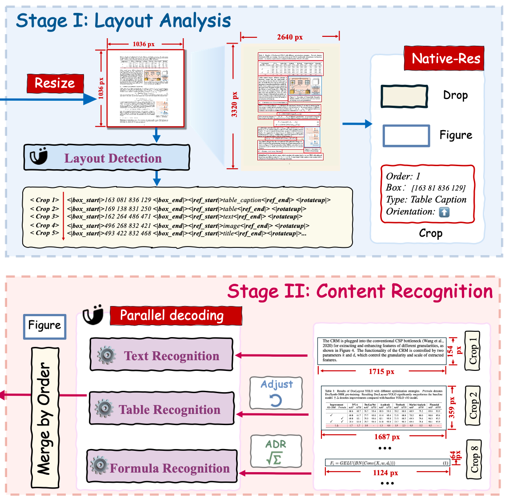
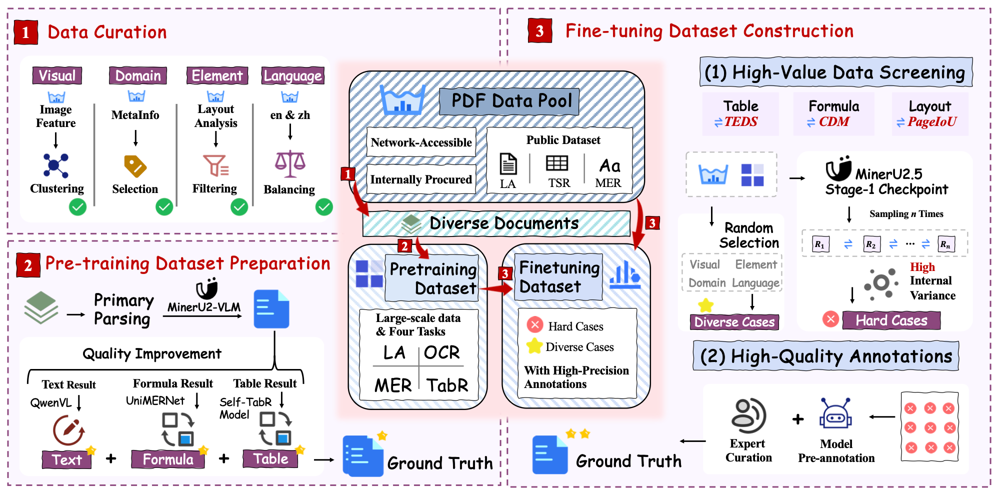
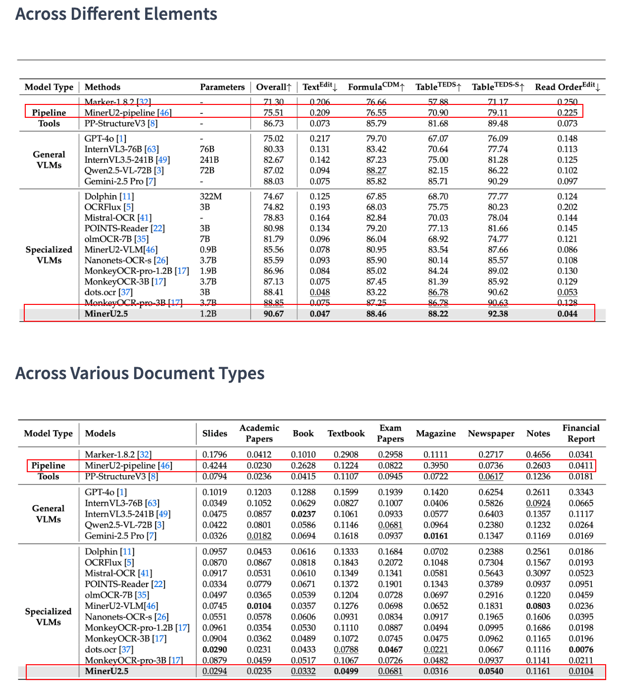

# MinerU2.5

## 1. 模型架构：Two-Stage Parsing Strategy

### 1.1 Framework

采用两阶段解析策略：

**Stage I: Layout Analysis（布局分析）**
- 输入 Sample 图像
- Layout Detection 检测页面布局元素
- 输出：Text、Drop、Figure 等区域的边界框

**Stage II: Content Recognition（内容识别）**
- Parallel decoding 并行解码
- 分别识别：Text Recognition、Table Recognition、Formula Recognition
- 最终输出结构化的解析结果

### 1.2 优势

- **降低计算成本**：避免端到端方法中 O(N²) 复杂度的 visual tokens
- **提升泛化能力**：两阶段可独立优化和迭代，鲁棒性更强
- **高效推理**：仅 1.2B 参数量，实现高精度的文档解析

---

## 2. 训练

### 2.1 Stage 0 - Modality Alignment

- **Language-Image Alignment**
  数据集：[LLaVA-Pretrain](https://huggingface.co/datasets/liuhaotian/LLaVA-Pretrain)

- **Visual Instruction Tuning**
  数据集：[LLaVA-Instruct-150K](https://huggingface.co/datasets/liuhaotian/LLaVA-Instruct-150K/tree/main)

### 2.2 Stage 1 - Document Parsing Pre-training

- 使用不同的 **prompt** 隔离不同 task（layout analysis、text、formula、table）
- 大规模多任务文档预训练
- 训练配置：6M samples，2 epochs
  - Layout analysis: 2.0M
  - Text blocks: 2.0M
  - Formula blocks: 1.3M
  - Table blocks: 0.7M

### 2.3 Stage 2 - Document Parsing Fine-tuning

- 使用**困难样本 + 人工标注**精调集
- 训练配置：800K samples，3 epochs
  - Layout analysis: 300K
  - Text blocks: 147K
  - Formula blocks: 147K
  - Table blocks: 140K

---

## 3. Data Engine

### 3.1 自动化标注 Pre-training Data Annotation

**布局检测流程：**
1. 先用 MinerU2-pipeline 跑一遍初步标注
2. 使用内部更强的专家模型做投票打分：
   - Qwen2.5-VL-72B
   - UniMERNet
   - 自研表格模型
3. 低置信样本丢弃，保留高质量标注

### 3.2 困难样本挖掘 Fine-tuning Data Annotation

1. 将 Stage-1 模型在未标注池中做**多轮随机推理**
2. 使用一致性指标评估：PageIoU / CDM / TEDS
3. **一致性低**的页面自动标为"困难样本"
4. 困难样本送**人工标注**
5. 最终得到 **63万页** "困难+高质量" 子集（用于 Stage-2 微调）

---

## 4. Performance on OmniBench

| Model Type | Models | Across Different Elements |
|------------|--------|---------------------------|
| Pipeline | MinerU2-pipeline | 基准方案 |
| Specialized VLM | MinerU2.5 | 多项指标领先 |

*在 Across Different Elements 和 Across Various Document Types 两个维度上表现优异*

---

## 5. Future Work

- **替换 MoI 解析模型**（parse server 部分代码）

- **参考 data engine，搭建自动标注 + 人工辅助 pipeline**
  - 模型针对客户数据中的 bad case 做 feedback 后生成微调集
  - 维护一个用于增量训练的 general 数据集 [DocLayNet](https://huggingface.co/datasets/ds4sd/DocLayNet)，用于混合客户的 bad case 做训练，避免模型能力损失

- **长期目标 — Data Curation**
  - 搜集客户数据
  - 建立数据质量改进闭环：PDF → Model → Output → Result（good/bad 分类）→ Finetuning data → Quality Improvement

